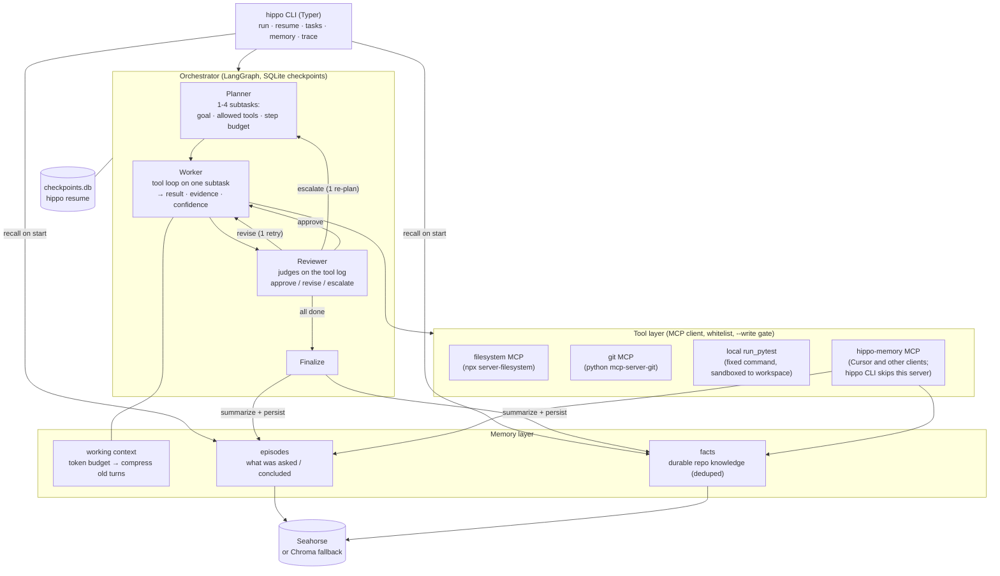

# hippo

[](https://github.com/JuneC7020/hippo/actions/workflows/ci.yml)

**A CLI coding agent that remembers.** It works in your repo through MCP tools, splits real tasks
into planner → worker → reviewer steps with LangGraph, and writes what it learned into a vector
memory (Seahorse, or local Chroma) so the *next* session starts knowing the repo.

```
hippo run  "task"          plan -> work -> review -> answer, then remember
hippo resume TASK_ID       pick up a killed run at its last checkpoint
hippo memory "query"       what would be recalled for this question
hippo trace  TASK_ID       every plan, tool call and review, one line each
```

## Two demos, one minute

**Demo 1 - onboard once, ask later with tools off.** Session 2 is a fresh process with `--oneshot`
(no tools); everything it says comes from recalled memory.


**Demo 2 - fix a failing test suite with `--write`.** The planner delegates, the worker edits and
re-runs pytest, the reviewer judges on the tool log. Note the `REVISE` on s2: the worker named the
bug but had not shown the failing values, so it was sent back once.


Both are scripts against the bundled sandbox repo (`examples/sandbox`, a tiny invoicing library with
one rounding bug and two failing tests):

```bash
scripts/demo1_onboarding.sh      # Windows: .\scripts\demo1_onboarding.ps1
scripts/demo2_fix_test.sh        #          .\scripts\demo2_fix_test.ps1   (then: git checkout -- examples/sandbox)
```

Transcripts above are lightly condensed from real runs with `gpt-4o-mini`; traces are in
`docs/demo*.txt`. The SVGs are rendered from those transcripts by `scripts/render_demo_svg.py`.

**Demo 3 - the same memory, over MCP.** After demo 1, Cursor (or any MCP client) searches the
store hippo just wrote. hippo skips this server internally; other processes connect. Setup:
[`docs/cursor.md`](docs/cursor.md). Protocol check without the IDE:

```bash
python scripts/demo3_mcp_share.py
```


## Architecture



A run: **recall** (top-k facts + episodes injected into every prompt) → **planner** emits 1-4
subtasks → for each, **worker** runs a bounded tool loop and returns `{result, evidence,
confidence}` → **reviewer** sees the worker's actual tool log and approves, sends back once with
feedback, or escalates → **planner** re-plans once, keeping finished subtasks → **finalize** writes
the answer (partial if something failed) → **persist** summarizes the run into one episode plus
durable facts. Every node boundary is a checkpoint, so `hippo resume` continues where a killed
process stopped.

## Quickstart

```bash
git clone https://github.com/JuneC7020/hippo && cd hippo
python -m venv .venv && . .venv/bin/activate      # Windows: .venv\Scripts\activate
pip install -e ".[dev]"
cp .env.example .env                                # set OPENAI_API_KEY (Seahorse key optional)
hippo run -w path/to/your/repo "What does this repo do and how do I run its tests?"
```

Needs Python 3.12 and Node (for the filesystem MCP server via `npx`). Without Node, or with
`--no-mcp`, hippo falls back to built-in read-only file tools plus `run_pytest`.

**Docker, one line** (mount the repo at `/workspace`, keep memory in a volume):

```bash
docker build -t hippo -f docker/Dockerfile .
docker run --rm -it --env-file .env -v "$PWD:/workspace" -v hippo-data:/data hippo run "Onboard me to this repo"
```

### Commands and flags

| | |
|---|---|
| `hippo run [-w DIR] "task"` | full graph run in `DIR` (default `HIPPO_WORKSPACE` or `.`) |
| `--write` | unlock write/edit/delete/commit tools (off by default; reads and `run_pytest` are always allowed) |
| `--oneshot` | no tools, answer from recall only; **does not write memory** |
| `--single` | the M1 single-agent tool loop, no planner/reviewer |
| `--no-mcp` / `--no-memory` / `--demo` | local tools only / skip recall+persist / use `HIPPO_DEMO_MODEL` |
| `hippo resume TASK_ID` | continue an `interrupted`/`failed` task from its checkpoint |
| `hippo tasks` · `hippo memory "q"` · `hippo trace [ID] [--raw]` | task table · recall preview · run trace |

Environment (`.env`): `OPENAI_API_KEY`, `HIPPO_MODEL` (default `gpt-4o-mini`), `HIPPO_DEMO_MODEL`,
`HIPPO_MEMORY_BACKEND=auto|seahorse|chroma`, `SEAHORSE_API_KEY`, `HIPPO_TOKEN_BUDGET` (8000),
`HIPPO_DATA_DIR` (`.hippo`), `HIPPO_WORKSPACE`, `HIPPO_MCP_CONFIG`.

## Design decisions

1. **Two memory tables, not one.** *Episodes* answer "what happened last time" (the failing tests,
   the file we changed); *facts* answer "what is true about this repo" (paths, conventions). They
   are searched separately and recall reserves a slot for episodes so a pile of short facts cannot
   crowd out the story. Facts are deduplicated on write (token Jaccard ≥ 0.8), and only
   **grounded** runs write memory - a `--oneshot` answer is recall plus a guess, and storing it would
   feed hearsay back into recall.

2. **Compression and recall do different jobs.** Inside a subtask, old tool turns are summarized
   when the prompt passes the token budget (last 4 turns verbatim, prior notes folded into one).
   That keeps continuity within a run. Recall is selective precision *across* runs. Neither can
   replace the other.

3. **Tools live behind MCP.** filesystem and git are separate processes speaking a protocol, so they
   can be swapped or added without touching agent code; the same wrapper turns any server's JSON
   schema into a typed LangChain tool. The one local tool, `run_pytest`, is a fixed command (not a
   shell) confined to the workspace, so it is safe without `--write`. hippo's *own* memory is also
   an MCP server (`python -m hippo.mcp_server`) so Cursor can search the same store; the CLI skips
   that server to avoid opening Chroma twice in one process.

4. **What the planner hands down and what comes back.** Down: one-sentence goal, *extra* allowed
   tools, step budget. Every worker also gets a baseline of read tools and `run_pytest` - reading
   the repo is never the privilege the planner is deciding about; writing is. Up: `result`,
   `evidence`, `confidence`. Budgets are clamped to ≥ 6 steps because planners under-estimate, and a
   worker whose budget runs out gets one final no-tools turn, so a tight budget yields a partial
   answer rather than silence.

5. **The reviewer judges the tool log, not the prose.** The worker's actual calls and result tails
   (edit diffs, pytest exit codes) go into the reviewer prompt. Before that, the reviewer rejected a
   correct fix twice because the worker's self-report was thin. Cost: one extra LLM call per
   subtask; gain: a bounded retry/escalate loop that cannot spin - revise once, then escalate, then
   re-plan once, then report what failed.

6. **Nothing non-serializable in graph state.** Tools, tracer and the LLM travel in LangGraph's
   runtime context; state is plain dicts. That is what makes `checkpoints.db` restorable from a
   new process: `hippo resume` reconnects the MCP servers and continues at the node that was
   running.

## What broke in live runs, and what changed

These are all from `hippo trace` of real runs, not hypotheticals.

- **MCP + anyio cancel scopes.** Opening `stdio_client` in the main task and closing it later (or
  after a failed connect) raised *"Attempted to exit cancel scope in a different task"* and
  cancelled an unrelated `aiosqlite` await. Each MCP client now lives in its own asyncio task for
  its whole lifetime; the main task only sends requests (`_TaskScopedClient`).
- **Nested tool schemas were flattened.** `edit_file(edits: [{oldText, newText}])` became a bare
  `list`, OpenAI's function schema lost `items`, and the model invented keys (`remove/add`,
  `old/new`) four times in a row. The schema converter now builds nested pydantic models.
- **Workers guessed paths.** Six of a budget of six steps went to `search_files`/`list_directory`
  before the edit. Workers now get a shallow workspace tree in the prompt and an explicit nudge when
  they repeat an identical call with an identical result.
- **The planner gave the edit subtask only `edit_file`.** See decision 4: baseline tools.
- **Seahorse.** Real service issues on 2026-09-15 (async table creation vs a 15 s gateway timeout →
  duplicate tables; no sparse inference endpoint → hybrid inserts fail; `active-set-flush` 408 →
  rows accepted but never indexed). `SeahorseStore` manages the table lifecycle itself and creates
  dense-only tables; `scripts/seahorse_tables.py` lists/prunes. Until the flush issue is fixed the
  demos run on `HIPPO_MEMORY_BACKEND=chroma` - the agent code path is identical, which is the point
  of the fallback.

## Limitations

- Single user, single machine. Task metadata is SQLite; the seam for Postgres/Redis is
  `store/sqlite.py`, not designed further.
- The reviewer checks that tests pass, not that the fix is *right*: in demo 2 it accepted
  `round()` (banker's rounding) for a "round half up" spec because the tests did not distinguish.
- Memory quality is not measured yet; recall is plain dense top-k with a fixed episode share.
- Prompt-injection defence is the tool whitelist and the `--write` gate, nothing semantic.
- `gpt-4o-mini` plans conservatively (often a single "read the README" subtask); demos use
  explicit prompts. `--demo` switches to `HIPPO_DEMO_MODEL`.
- Local Chroma is one-process-at-a-time on a given data dir (Windows file lock). CLI and Cursor
  should take turns, not overlap. Seahorse does not have this limit.

## Development

```bash
pip install -e ".[dev]"
ruff check src tests scripts && ruff format --check src tests scripts
pytest -q                      # no network: FakeLLM drives the graph; MCP server round-trip uses local Chroma
```

Interview deck (keyboard: ← →): open [`docs/slides.html`](docs/slides.html) in a browser.

```
src/hippo/
  cli.py                  run / resume / tasks / memory / trace
  mcp_server.py           hippo-memory MCP server (search / remember / ingest / status)
  agent/graph.py          planner, worker, reviewer, finalize nodes + tool_loop
  agent/context.py        token counting, compression of old tool turns
  agent/state.py          checkpointed state types, RunContext (not checkpointed)
  tools/mcp_client.py     MCP hub (1.x/2.x), schema -> pydantic, run_pytest, workspace tree, fallbacks
  tools/registry.py       whitelist, call budget, dangerous-tool gate
  memory/                 MemoryStore protocol, SeahorseStore, ChromaStore, MemoryManager
  store/sqlite.py         task rows (LangGraph checkpoints live in checkpoints.db)
examples/sandbox/         demo target repo (invoicely) with a deliberate bug
scripts/                  demo1/demo2/demo3, Seahorse tools, SVG renderer
docs/                     architecture, demo transcripts+SVGs, Cursor MCP setup, slides.html
docker/Dockerfile         python:3.12-slim + node 20 + git, ENTRYPOINT hippo
```

Keys go in `.env` only, never `.env.example`. MIT license.
